  

  
  
  
  
  
  

# 📡 Awesome Telecom Network Automation

> A comprehensive, SEO-optimized, curated list of enterprise SaaS platforms, open-source NFV/SDN orchestrators, 5G Core, O-RAN RIC platforms, and OSS/BSS software powering modern communications service providers (CSPs).

---

## 🔍 Overview & SEO Keywords

**Telecom Network Automation** plays a vital role in modern telecommunications infrastructure, enabling Service Level Agreement (SLA) management, closed-loop network assurance, automated 5G network slicing, and zero-touch service provisioning. 

Key domains covered:
* **OSS / BSS Automation**: Operations Support Systems & Business Support Systems aligned with TM Forum, MEF, and 3GPP.
* **Network Orchestration**: MANO (Management and Orchestration), cloud-native NFV (Network Functions Virtualization), and VNF/CNF lifecycle management.
* **SDN Controllers & O-RAN**: Software-Defined Networking (ONOS, OpenDaylight) and Near-Real-Time RAN Intelligent Controllers (RIC).
* **Cloud-Native 5G Core & RAN**: Open-source 5G standalone (SA) core networks (Free5GC, Open5GS, Magma) and gNodeB RAN software (srsRAN, OpenAirInterface).

---

## 📑 Table of Contents

- [☁️ SaaS & Enterprise Commercial Platforms](#%EF%B8%8F-saas--enterprise-commercial-platforms)
- [🔓 Open-Source GitHub Projects](#-open-source-github-projects)
- [🤝 How to Contribute](#-how-to-contribute)
- [⚠️ Disclaimer](#%EF%B8%8F-disclaimer)
- [💖 Support & Community](#-support--community)
- [⭐ Star History](#-star-history)

---

## ☁️ SaaS & Enterprise Commercial Platforms

> **📊 Market Overview:** The global **Telecom Network Automation & OSS/BSS market** is estimated at **$48.5 Billion in 2026** (projected to reach **$92 Billion by 2032** at an 11.5% CAGR). The sector is **moderately fragmented**, partitioned between cloud hyperscalers (AWS, Broadcom/VMware), legacy telecom equipment manufacturers (Nokia, Ericsson, Cisco, Juniper), and specialized OSS/BSS automation vendors (Amdocs, Netcracker, Ciena Blue Planet), with no single enterprise holding winner-take-all dominance.

Below is the curated list of enterprise SaaS & commercial telecom network automation platforms, sorted by **Company Size (Revenue / Valuation)** in descending order:

| 🏢 Platform / SaaS Name | 📝 Description | 💵 Specific Pricing Tier | 🎁 Free Tier / Free Trial Limit | 📊 Company Size (Valuation / Revenue) |
| :--- | :--- | :--- | :--- | :--- |
| **[AWS Telco Network Builder](https://aws.amazon.com/telco-network-builder/)** | Managed AWS service automating network function lifecycle management & NFV deployment on AWS infrastructure. | $0.05 per VNF/CNF managed per hour (~$36/mo per network function) + underlying EC2 resource costs | 12-Month Free Tier (750 hours/mo EC2 & free tier eligible AWS cloud resources) | **$1.8 Trillion** Valuation ($90B+ AWS Revenue) |
| **[VMware Telco Cloud](https://www.vmware.com/)** | Cloud-native telco platform for NFV infrastructure, core slicing, and automated network orchestration. | ~$3,125 per CPU socket pair/year (Broadcom Subscription model starting at $350/core/year) | 30-Day Evaluation License via VMware Hands-on-Labs (HOL) with full feature access | **$800+ Billion** Valuation ($35B+ Revenue) |
| **[Cisco Crosswork](https://www.cisco.com/)** | Comprehensive network automation & assurance suite for service provider transport and IP networks. | Starting at $15,000/year for entry-level Crosswork Network Controller subscription tier | 30-Day Cisco dCloud Sandbox & Evaluation License with pre-packaged telco topologies | **$200+ Billion** Valuation ($57B Revenue) |
| **[Nokia AVA](https://www.nokia.com/networks/ava/)** | AI-powered analytics, energy efficiency, and network automation SaaS suite for multi-vendor networks. | Starting at $20,000/month for AVA SaaS micro-apps (e.g., AVA Energy Efficiency & Operations) | 30-Day Guided SaaS Demo & Proof-of-Concept (PoC) tenant upon request | **$25 Billion** Valuation ($23B Revenue) |
| **[Netcracker Digital OSS](https://www.netcracker.com/)** | Microservices-based Digital BSS/OSS suite compliant with TM Forum & 3GPP standards, integrating with ETSI OSM. | Starting at $15,000/month module subscription for cloud-native OSS orchestration | 30-Day Managed Cloud PoC Trial for qualified telecommunications operators | **$25 Billion** Valuation ($25B+ Parent NEC Revenue) |
| **[Ericsson Dynamic Orchestration](https://www.ericsson.com/)** | Service orchestration and multi-domain network lifecycle automation for 5G enterprise slices. | Starting at $25,000/month for core network orchestration software subscription | 60-Day Partner Sandbox & Customer Innovation Center trial access | **$20 Billion** Valuation ($24B Revenue) |
| **[Juniper Paragon](https://www.juniper.net/)** | Intent-based network automation suite for active assurance, route optimization, and device onboarding. | Starting at $12,000/year for Paragon Automation Flex licensing per 100 managed devices | 30-Day Free Trial via Juniper vLabs cloud sandbox | **$14 Billion** Valuation ($5.6B Revenue) |
| **[Amdocs Intelligent Networking Suite](https://www.amdocs.com/)** | Full-stack cloud-native OSS/BSS suite automating service fulfillment, inventory, and network slicing. | Starting at $18,000/month SaaS base subscription for service orchestration module | 30-Day Interactive Sandbox & Demo Tenant for enterprise CSP evaluation | **$10 Billion** Valuation ($4.9B Revenue) |
| **[Blue Planet (Ciena)](https://www.blueplanet.com/)** | Multi-domain service orchestration (MDSO), inventory management, and unified network policy automation. | Starting at $10,000/month SaaS subscription for Blue Planet MDSO platform | 30-Day Developer Sandbox & API Trial via Ciena Developer Portal | **$8 Billion** Valuation ($4.4B Revenue) |
| **[Mavenir MAVair](https://www.mavenir.com/)** | Open RAN and cloud-native network automation suite for distributed 5G radios and vRAN controllers. | Starting at $8,000/month per RAN site cloud automation suite | 30-Day Virtualized RAN Automation Testbed Trial for CSPs | **$3 Billion** Valuation (~$500M Revenue) |

---

## 🔓 Open-Source GitHub Projects

> **⭐ Stars_Badge Notice:** All open-source projects are sorted by **GitHub Stars_Count** in descending order. Click on any Stars_Badge to visit the project's stargazers page!

| 🌟 Stars | 📦 Repository & Project Name | 🏷️ Category | 📜 License | 📝 Description |
| :---: | :--- | :--- | :--- | :--- |
|  | **[srsRAN 4G](https://github.com/srsran/srsRAN_4G)** | 📶 5G/4G RAN | AGPL-3.0 | Open-source 4G/5G software radio access network (RAN) implementation optimized for software-defined radios (SDRs). |
|  | **[Kamailio](https://github.com/kamailio/kamailio)** | ☎️ SIP Routing | GPL-2.0 | High-performance open-source SIP server handling millions of call setups/sec for telecom routing and VoLTE/VoNR. |
|  | **[Open5GS](https://github.com/open5gs/open5gs)** | 📶 5G Core | AGPL-3.0 | C-language open-source implementation of 5G Core and EPC for 4G/5G mobile communication networks. |
|  | **[free5GC](https://github.com/free5gc/free5gc)** | 📶 5G Core | Apache-2.0 | Open-source 5G mobile core network based on 3GPP Release 15/16 standards written in Go. |
|  | **[Magma Core](https://github.com/magma/magma)** | 📶 Converged Core | BSD-3-Clause | Open-source core network platform for converged wireless access (LTE, 5G, Wi-Fi) managed via cloud native controllers. |
|  | **[OpenSIPS](https://github.com/OpenSIPS/opensips)** | ☎️ SIP Routing | GPL-2.0 | Multi-functional, open-source SIP server focusing on high throughput voice, video, and telecom signaling routing. |
|  | **[ONOS](https://github.com/opennetworkinglab/onos)** | ⚙️ SDN Controller | Apache-2.0 | Carrier-grade SDN controller designed for high availability, scalability, and performance in service provider networks. |
|  | **[srsRAN Project](https://github.com/srsran/srsRAN_Project)** | 📶 5G RAN | AGPL-3.0 | Modular 5G RAN software suite implementing gNB for Open RAN deployments and software radio hardware. |
|  | **[UERANSIM](https://github.com/aligungr/UERANSIM)** | 🧪 5G Simulator | GPL-3.0 | Open-source 5G UE (User Equipment) and gNodeB (RAN) simulator for testing 5G core network implementations. |
|  | **[OpenDaylight Controller](https://github.com/opendaylight/controller)** | ⚙️ SDN Controller | EPL-1.0 | Modular open SDN controller platform hosted by the Linux Foundation for data center and telecom network management. |
|  | **[OpenAirInterface 5G](https://github.com/openairinterface/openairinterface5g)** | 📶 5G Core & RAN | OAI Public | Open-source 3GPP-compliant software stack for 5G RAN and Core network deployment and research. |
|  | **[Nephio](https://github.com/nephio-project/nephio)** | ⚙️ Edge Orchestration | Apache-2.0 | Kubernetes-native cloud automation framework for intent-based multi-cloud network function orchestration. |
|  | **[ONAP (OOM)](https://github.com/onap/oom)** | ⚙️ NFV MANO | Apache-2.0 | Linux Foundation comprehensive orchestration and automation platform for physical and virtual network functions. |
|  | **[NMS Prime](https://github.com/nmsprime/nmsprime)** | 💼 OSS / BSS | GPL-3.0 | Open-source modular provisioning, CRM, BSS, and OSS platform tailored for telecommunication operators and ISPs. |
|  | **[ETSI OpenSlice](https://github.com/etsi-osl/osl)** | 💼 OSS / NaaS | Apache-2.0 | ETSI open-source Operations Support System (OSS) delivering Network-as-a-Service (NaaS) and network slicing. |
|  | **[O-RAN Near-RT RIC](https://github.com/o-ran-sc/ric-plt-e2)** | 📶 O-RAN RIC | Apache-2.0 | O-RAN Software Community Near-Real-Time RAN Intelligent Controller platform for sub-second xApp control loops. |

---

## 🤝 How to Contribute

Contributions are warmly welcome! Please follow these simple steps:

1. 🍴 **Fork this repository**.
2. 📝 **Add or update entries** in `README.md` (keep descriptions concise, objective, and accurately categorized).
3. 🔗 Ensure all links point to official websites or GitHub repositories.
4. 🔀 **Submit a Pull Request** with a brief summary of changes.

---

## ⚠️ Disclaimer

- This repository is a **community-curated list** for informational and educational purposes.
- Telecom network automation systems manage critical infrastructure; proper security hardening, redundancy, and regulatory compliance are essential for production deployments.
- **ONAP** is feature-rich for closed-loop operations but resource-intensive; **ETSI OSM** provides lighter, standards-compliant MANO orchestration.

---

## 💖 Support & Community

Thank you for exploring **Awesome Telecom Network Automation**! If you find this repository valuable for your telecom engineering, cloud-native 5G, or network orchestration work, please consider supporting the project:

- ⭐ **Star this repository** to help others discover it!
- 🔀 **Fork and share** with your network, team, and telecom community.
- 💬 Join the conversation on our [Discord Community](https://discord.gg/jc4xtF58Ve).
- ☕ **Sponsor / Buy me a coffee**: If you'd like to support ongoing updates and maintenance, consider sponsoring on the [GitHub Sponsor Dashboard](https://github.com/sponsors/ishandutta2007).

---

## ⭐ Star History

